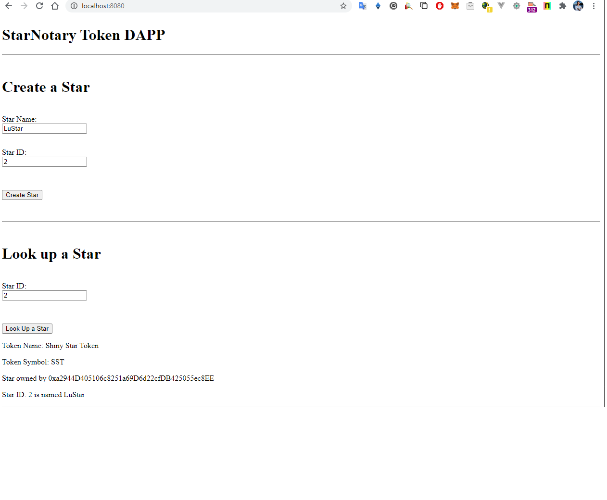
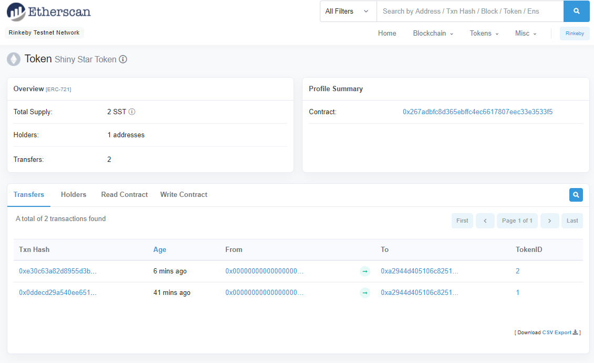

- [Course 2 Project: Ethereum Smart Contracts, Tokens, and Dapps - Build CryptoStar Dapp on Ethereum](#course-2-project-ethereum-smart-contracts-tokens-and-dapps---build-cryptostar-dapp-on-ethereum)
	- [Project Instructions](#project-instructions)
		- [Task 1 - Add Smart Contract Functions](#task-1---add-smart-contract-functions)
		- [Task 2 - Add supporting Unit Tests](#task-2---add-supporting-unit-tests)
		- [Task 3 - Deploy your Contract to Rinkeby](#task-3---deploy-your-contract-to-rinkeby)
		- [Task 4 - Modify the front end of the DAPP](#task-4---modify-the-front-end-of-the-dapp)
		- [Task 5 - Add a ``Readme.md`` file](#task-5---add-a-readmemd-file)
		- [Helpful Links](#helpful-links)
	- [Steps to Install the Environment](#steps-to-install-the-environment)
		- [Node.js](#nodejs)
		- [Truffle and other packets](#truffle-and-other-packets)
	- [To compile and run tests](#to-compile-and-run-tests)
	- [Versions](#versions)
	- [Results](#results)
		- [Unit Tests Terminal Output](#unit-tests-terminal-output)
	- [To deploy in Brinkeby](#to-deploy-in-brinkeby)
		- [Deployment Terminal Output](#deployment-terminal-output)
		- [Contract Address](#contract-address)
		- [Token Address](#token-address)
		- [Transaction Hashes](#transaction-hashes)
		- [Frontend screenshots](#frontend-screenshots)
		- [Etherscan screenshots](#etherscan-screenshots)

# Course 2 Project: Ethereum Smart Contracts, Tokens, and Dapps - Build CryptoStar Dapp on Ethereum

With Project 2, your focus moves from Bitcoin to Ethereum
blockchain. You’ll begin by building a decentralized app (Dapp) that allows you to create, sell, and transfer ownership of unique star token (CryptoStar) on the Ethereum blockchain using smart contracts and the non-fungible (ERC721) token standard. This service is designed to demonstrate how to claim and transfer ownership of unique digital asset ( e.g. document, deed, agreement, media, etc.) on Ethereum blockchain.

You’ll build the back-end infrastructure for the CryptoStar with a pre-developed front end. This will enable you to render the service on any modern web clients.

For this project, you will create DApp notary service leveraging the Ethereum platform. You write smart contract that offer securely prove the existence for any digital asset - in this case unique stars and their metadata!

## Project Instructions

### Task 1 - Add Smart Contract Functions

Your Project is to Modify the StarNotary version 2 contract code to achieve the following:
| SubTasks   | Details |  Status |
|:-------:|:--------|:--------:|
| 1.1 | Add a name and a symbol for your starNotary tokens. | :ok_hand: |
| 1.2 | Add a function lookUptokenIdToStarInfo, that looks up the stars using the Token ID, and then returns the name of the star.   | :ok_hand: |
| 1.3 | Add a function called exchangeStars, so 2 users can exchange their star tokens...Do not worry about the price, just write code to exchange stars  between users.  | :ok_hand: |
| 1.4 | Write a function to Transfer a Star. The function should transfer a star from the address of the caller. The function should accept 2 arguments, the address to transfer the star to, and the token ID of the star.  | :ok_hand: |

### Task 2 - Add supporting Unit Tests

Add supporting unit tests, to test the following:
| SubTasks   | Details |  Status |
|:-------:|:--------|:--------:|
| 2.1 | The token name and token symbol are added properly.  | :ok_hand: |
| 2.2 | 2 users can exchange their stars.  | :ok_hand: |
| 2.3 | Stars Tokens can be transferred from one address to another.  | :ok_hand: |

### Task 3 - Deploy your Contract to Rinkeby

Deploy your Contract to Rinkeby.
| SubTasks   | Details |  Status |
|:-------:|:--------|:--------:|
| 3.1 | Edit the truffle.config file to add settings to deploy your contract to the Rinkeby Public Network.  | :ok_hand: |

### Task 4 - Modify the front end of the DAPP

Modify the front end of the DAPP to achieve the following:

| SubTasks   | Details |  Status |
|:-------:|:--------|:--------:|
| 4.1 | Lookup a star by ID using tokenIdToStarInfo() (you will have to add code for this in your index.html and index.js files)  | :ok_hand: |

### Task 5 - Add a ``Readme.md`` file

The ``Readme.md`` file should include the following:
| SubTasks   | Details |  Status |
|:-------:|:--------|:--------:|
| 5.1 | Your ERC-721 Token Name  | :ok_hand: |
| 5.2 | Your ERC-721 Token Symbol  | :ok_hand: |
| 5.3 | Version of the Truffle and OpenZeppelin used  | :ok_hand: |

### Helpful Links

- answered the question [Fixed parser error in Solidity extension of VSCode: ParserError: Expected identifier, got 'LParen'](https://ethereum.stackexchange.com/questions/51353/parsererror-expected-identifier-got-lparen/87686#87686)

## Steps to Install the Environment

### Node.js

Install a clean version of nodejs. I´m using the nvm (Node Version Manager) tool to allow install and switch between versions. Currently only version 10 of node.js works:

```bash
nvm install 10.22.1
nvm use 10.22.1
```

### Truffle and other packets

install truffle, openzelepin, webpack and dependences:

```bash
npm i -g truffle
npm i --save openzeppelin-solidity
npm i --save truffle-hdwallet-provider
npm i -g webpack
npm i -g webpack-dev-server webpack-cli webpack-dev-middleware webpack-hot-middleware copy-webpack-plugin
```

## To compile and run tests

For starting the development console, run:

```bash
truffle develop
```

For compiling the contract, inside the development console, run:

```bash
compile
```

For migrating the contract to the locally running Ethereum network, inside the development console, run:

```bash
migrate --reset
```

For running unit tests the contract, inside the development console, run:

```bash
test
```

For running the Front End of the DAPP, open another terminal window and go inside the project directory, and run:

```bash
cd app
npm run dev
```

## Versions

| Package   | Version |
|:-------:|:-------------|
|Truffle| v5.1.48 (core: 5.1.48) |
|Solidity| 0.6.12 (solc-js) |
|Node| v10.22.1 |
|Web3.js| v1.2.1 |

As configured in truffle-config.js the smart contracts was compiled successfully using:

- solc: 0.6.12+commit.27d51765.Emscripten.clang

## Results

### Unit Tests Terminal Output

```bash
truffle develop

Compiling your contracts...
===========================
> Everything is up to date, there is nothing to compile.


  √ can Create a Star (140ms)
  √ lets user1 put up their star for sale (175ms)
  √ lets user1 get the funds after the sale (281ms)
  √ lets user2 buy a star, if it is put up for sale (305ms)
  √ lets user2 buy a star and decreases its balance in ether (273ms)
  √ 1.1 - can create a star with a name and star symbol properly, 1.2 lookup a star (157ms)
  √ 1.3 - can 2 users exchange their stars (436ms)
  √ 1.4 can a user transfer a star to other (162ms)

  8 passing (2s)

truffle(develop)>
```

## To deploy in Brinkeby

Execute the command

```bash
truffle migrate --network rinkeby --reset
```

### Deployment Terminal Output

```bash
PS C:\RIBAS\GITHUB\udacity-blockchaindev-nanodegree\project_2_CryptoStar_Dapp_on_Ethereum> truffle migrate --network rinkeby --reset

Compiling your contracts...
===========================
> Everything is up to date, there is nothing to compile.


Migrations dry-run (simulation)
===============================
> Network name:    'rinkeby-fork'
> Network id:      4
> Block gas limit: 10000000 (0x989680)


1_initial_migration.js
======================

   Deploying 'Migrations'
   ----------------------
   > block number:        7353368
   > block timestamp:     1602457237
   > account:             0xa2944D405106c8251a69D6d22cfDB425055ec8EE
   > balance:             2.99855805
   > gas used:            144195 (0x23343)
   > gas price:           10 gwei
   > value sent:          0 ETH
   > total cost:          0.00144195 ETH

   -------------------------------------
   > Total cost:          0.00144195 ETH


2_deploy_contracts.js
=====================

   Deploying 'StarNotary'
   ----------------------
   > block number:        7353370
   > block timestamp:     1602457264
   > account:             0xa2944D405106c8251a69D6d22cfDB425055ec8EE
   > balance:             2.96876974
   > gas used:            2951493 (0x2d0945)
   > gas price:           10 gwei
   > value sent:          0 ETH
   > total cost:          0.02951493 ETH

   -------------------------------------
   > Total cost:          0.02951493 ETH

Summary
=======
> Total deployments:   2
> Final cost:          0.03095688 ETH

Starting migrations...
======================
> Network name:    'rinkeby'
> Network id:      4
> Block gas limit: 10000000 (0x989680)

1_initial_migration.js
======================

   Deploying 'Migrations'
   ----------------------
   > transaction hash:    0xed1f231bdc5a34d605f9aee87f58190d3edfe394506e295579ff08464cda970d
   > Blocks: 1            Seconds: 13
   > contract address:    0xee17d101Fb5446351D8f92D7EFABb1d982fE0899
   > block number:        7353371
   > block timestamp:     1602457310
   > account:             0xa2944D405106c8251a69D6d22cfDB425055ec8EE
   > balance:             2.99840805
   > gas used:            159195 (0x26ddb)
   > gas price:           10 gwei
   > value sent:          0 ETH
   > total cost:          0.00159195 ETH

   > Saving migration to chain.
   > Saving artifacts
   -------------------------------------
   > Total cost:          0.00159195 ETH


2_deploy_contracts.js
=====================

   Deploying 'StarNotary'
   ----------------------
   > transaction hash:    0x125ec7b3e85dd301b9013048c90f08904e57a5b6c2ce0ff6a71335966e7fa4e8
   > Blocks: 0            Seconds: 13
   > contract address:    0x267adBfc8D365ebFFC4EC6617807EEc33e3533F5
   > block number:        7353373
   > block timestamp:     1602457340
   > account:             0xa2944D405106c8251a69D6d22cfDB425055ec8EE
   > balance:             2.96756974
   > gas used:            3041493 (0x2e68d5)
   > gas price:           10 gwei
   > value sent:          0 ETH
   > total cost:          0.03041493 ETH


   > Saving migration to chain.
   > Saving artifacts
   -------------------------------------
   > Total cost:          0.03041493 ETH


Summary
=======
> Total deployments:   2
> Final cost:          0.03200688 ETH

```

### Contract Address

contract address:    0x267adBfc8D365ebFFC4EC6617807EEc33e3533F5

### Token Address

<https://rinkeby.etherscan.io/token/0x267adbfc8d365ebffc4ec6617807eec33e3533f5>

### Transaction Hashes

transaction hash:    0x125ec7b3e85dd301b9013048c90f08904e57a5b6c2ce0ff6a71335966e7fa4e8

### Frontend screenshots



### Etherscan screenshots

<https://rinkeby.etherscan.io/token/0x267adbfc8d365ebffc4ec6617807eec33e3533f5>

