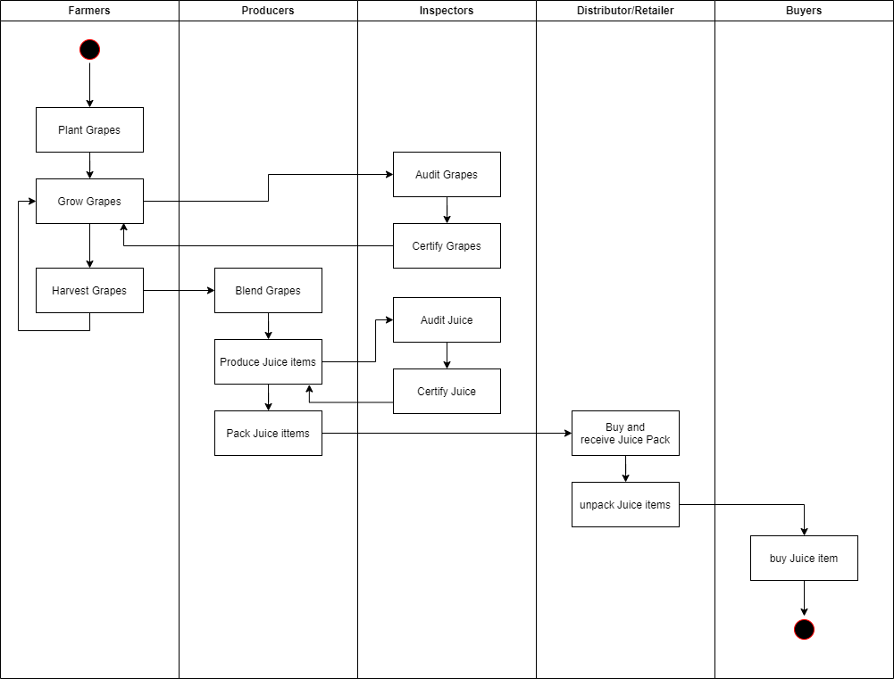
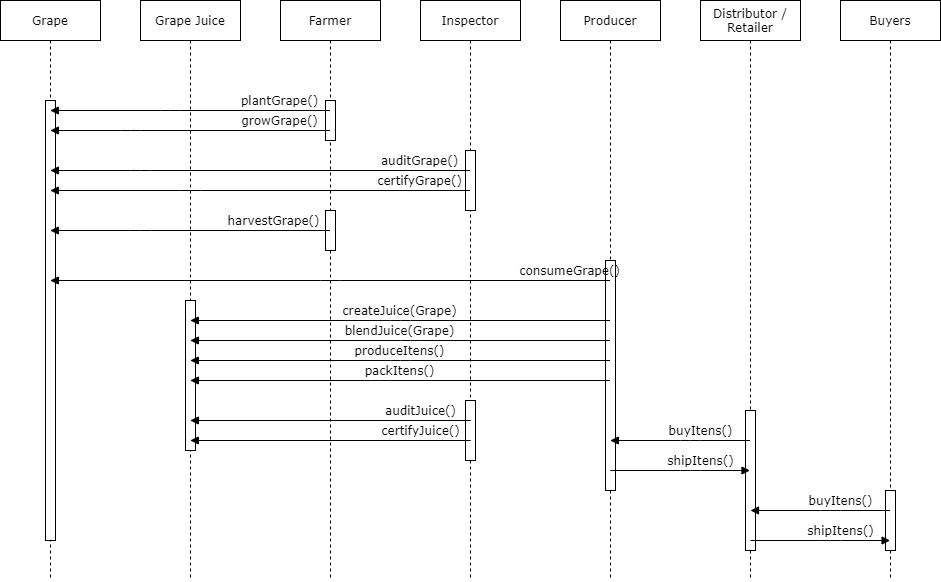
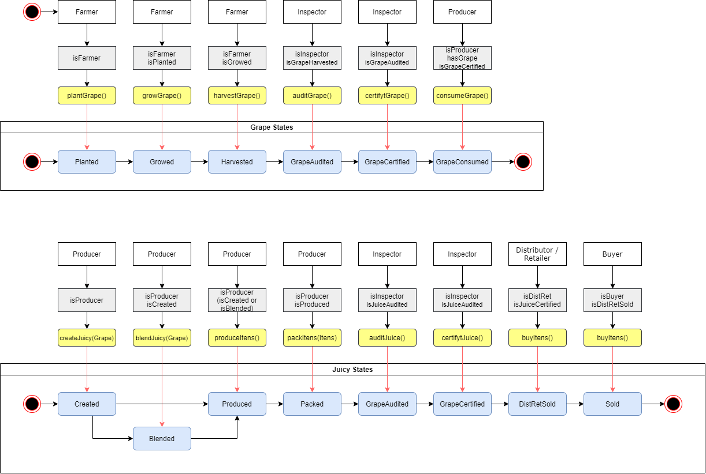
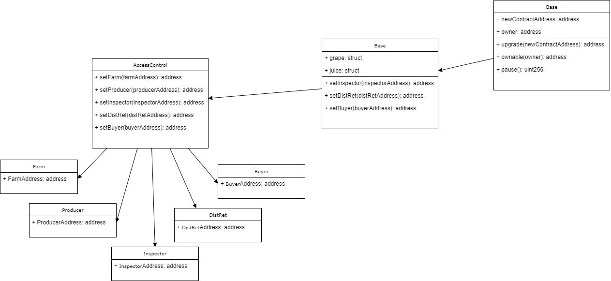

- [Course 3 Project: Blockchain Architecture - Build Ethereum Dapp for Tracking Items through Supply Chain](#course-3-project-blockchain-architecture---build-ethereum-dapp-for-tracking-items-through-supply-chain)
	- [Part 1: Plan the project with write-ups](#part-1-plan-the-project-with-write-ups)
		- [1.1 Project write-up - UML](#11-project-write-up---uml)
		- [1.2 Project write-up - Libraries](#12-project-write-up---libraries)
		- [1.3 Project write-up - IPFS](#13-project-write-up---ipfs)
		- [1.4 General Write Up](#14-general-write-up)
	- [Part 2: Write smart contracts](#part-2-write-smart-contracts)
	- [Part 3: Test smart contract code coverage](#part-3-test-smart-contract-code-coverage)
	- [Part 4: Deploy smart contracts on a public test network (Rinkeby)](#part-4-deploy-smart-contracts-on-a-public-test-network-rinkeby)
	- [Part 5: Modify client code to interact with smart contracts](#part-5-modify-client-code-to-interact-with-smart-contracts)
- [Frontend](#frontend)
	- [Frontend Online - Vue](#frontend-online---vue)
	- [Frontend Video Walkthrough](#frontend-video-walkthrough)
	- [Frontend screenshots](#frontend-screenshots)
	- [Optional: Implement Infura to store product image](#optional-implement-infura-to-store-product-image)
- [INSTALL STEPS](#install-steps)

# Course 3 Project: Blockchain Architecture - Build Ethereum Dapp for Tracking Items through Supply Chain

Create a DApp supply chain solution backed by the Ethereum platform. Architect smart contracts that manage specific user permission controls as well as contracts that track and verify a product’s authenticity.

By the completion of Project 2, you’ll have learned the importance of Proof of Existence, which is used to verify whether a digital asset is authentic and can be trusted. In this project, you’ll scale up to architect a solution that verifies authenticity for a product when multiple actors are involved.

You’ll build a supply chain system on Ethereum blockchain that allows users to verify the authenticity of an item as it passes through different hands. You will architect a Dapp (Decentralized Application) authenticity management system backed by the Ethereum platform. To do so, you’ll scope out the needs of the various actors in the supply chain and create smart contracts that help track product origination and verify product authenticity.

You’ll then tie this all together with a simple front-end that allows users to manage the product life-cycle as the product moves through the supply chain.

## Part 1: Plan the project with write-ups

### 1.1 Project write-up - UML

Definitions:

Choosen supply chain: Brazilian Grape Juice

| UML entity  | Details |
|:-------:|:--------|
| Asset | Grape,<br>Juice |
| Attributes | Grape:<br>- Current location<br>- Ownership<br>- Quantity available (kg)<br>- Geographical origin<br>- Date of harvest<br>- Juicy grape Variety: Niagara, Isabel, Bordo, Concord<br>- Farming system: Organic/Conventional<br>- Authenticity Third-party certifying body: IBD, EcoCert, Tecpar, Embrapa, etc<br><br>Juice:<br>- SKU<br>- Pack: units<br>- Location<br>- Ownership<br>- Stock: In stock/Sold<br>- Date of production<br>- Grape or blend of grapes and percentages<br>- Date of validity<br>- Suggar content<br>- Authenticity Third-party certifying body: IBD, EcoCert, Tecpar, Embrapa, etc<br> |
| Business Actions | Harvesting<br>Authenticity Certifying<br>Production<br>Distribution<br> |
| Role Permissions | Farm<br>Inspector<br>Productor<br>Distributor<br>Buyer |


References:
[1] "Effects of geographical origin, variety and farming system on the chemical markers and in vitro antioxidant capacity of Brazilian purple grape juices", Tiago Margraf, Érica Neulyana Taborda Santos, Eriel Forville de Andrade, Saskia M. van Ruth, Daniel Granato,
Food Research International,Volume 82,2016,Pages 145-155, ISSN 0963-9969, http://www.sciencedirect.com/science/article/pii/S0963996916300485


Project write-up include the following UML diagrams:

| Diagram   | Details |  Status |
|:-------:|:--------|:--------:|
| Activity |    | :ok_hand: |
| Sequence |    | :ok_hand: |
| State    |    | :ok_hand: |
| Classes<br>(Data Model) |    | :ok_hand: |

### 1.2 Project write-up - Libraries

If libraries are used, the project write-up discusses why these libraries were adopted.

| Libraries | Details |  Status |
|:-------:|:--------|:--------:|
| none |  none libraries are used | :ok_hand: |

### 1.3 Project write-up - IPFS

If IPFS is used, the project write-up discusses how IPFS is used in this project.

| IPFS | Details |  Status |
|:-------:|:--------|:--------:|
| none |  IPFS are not used | :ok_hand: |


### 1.4 General Write Up

A general write up exists to items like steps and contracts address.

| Item | Value | Details |  Status |
|:-------:|:-------:|:--------|:--------:|
| Smart Contract Address |   |  smart contract address in Rinkeby network | :ok_hand: |
| Farmer Address |   |  address in Rinkeby network | :ok_hand: |
| Producer Address |   |  address in Rinkeby network | :ok_hand: |
| Inspector Address |   |  address in Rinkeby network | :ok_hand: |
| Distributor/Retailer Address |   |  address in Rinkeby network | :ok_hand: |
| Consumer Address |   |  address in Rinkeby network | :ok_hand: |

## Part 2: Write smart contracts

Write smart contracts with functions

CRITERIA


| CRITERIA   | MEETS SPECIFICATIONS |  Status |
|:-------|:--------|:--------:|
| SupplyChain.sol contains required tracking functions. | Smart contract implements functions to track.<br>For example:<br>- Product ID<br>- Product UPC<br>- Origination Information<br>- Farm<br>- Misc organization info<br>- Longitude & Latitude of geo coordinates<br>- Product notes  | :ok_hand: |
| Ownable.sol contains required functions that establish owner and the transfer of ownership. | Ownable.sol has required functions that establish owner and the transfer of ownership.  | :ok_hand: |
| ConsumerRole.sol contains required functions that manage the consumer role. | ConsumerRole.sol has required functions that manage the consumer role.  | :ok_hand: |
| ProducerRole.sol contains required functions that manage the consumer role. | ProducerRole.sol has required functions that manage the consumer role.  | :ok_hand: |
| DistributorRole.sol contains required functions that manage the consumer role. | DistributorRole.sol has required functions that manage the consumer role.  | :ok_hand: |
| Additional roles implemented are integrated correctly. | Student has implemented additional roles correctly.  | :ok_hand: |

## Part 3: Test smart contract code coverage

| CRITERIA   | MEETS SPECIFICATIONS |  Status |
|:-------|:--------|:--------:|
| Test smart contract tests all required functions. | Project contains tests for the boiler plate functions and all tests are approved without error.  | :ok_hand: |

- Close all **ganache** instances on port 9545.
- Run **truffle** (on port 9545) with the following command:

```bash
  trufle develop
  
  # Compile
  truffle(develop)> compile
  
  # Test
  truffle(develop)> test
```

Please check the detailed setup instructions in the [link](../appvue/).


## Part 4: Deploy smart contracts on a public test network (Rinkeby)

| CRITERIA   | MEETS SPECIFICATIONS |  Status |
|:-------|:--------|:--------:|
| Deploy smart contract on a public test network. | a) Smart contract is deployed on on the Ethereum RINKEBY test network.<br>b) Project submission includes transaction ID and contract address.<br>c) Project submission includes a document (.md, .txt) that includes:<br>- Transaction ID<br>- Contract address | :ok_hand: |


## Part 5: Modify client code to interact with smart contracts

Modify client code to interact with a smart contract

| CRITERIA   | MEETS SPECIFICATIONS |  Status |
|:-------|:--------|:--------:|
| Client code interacts with smart contract. | Front-end is configured to:<br>- Submit a product for shipment (farmer to the distributor, distributor to Producer, etc).<br>- Receive product from shipment.<br>- Validate the authenticity of the product. | :ok_hand: |

# Frontend

## Frontend Online - Vue

Following there is a online version of Fronted deployed in GitHub pages:
[https://lucribas.github.io/prj3_Dapp_Supply_Chain/index.html](https://lucribas.github.io/prj3_Dapp_Supply_Chain/index.html).

## Frontend Video Walkthrough

[](https://www.youtube.com/watch?v=l4dS7XAedws)

## Frontend screenshots


## Optional: Implement Infura to store product image

Optional: Implement Infura to store product image

Ex: Farmer harvests coffee and upload pics w/ UPC hash
Potentially only 2 methods needed upload() and read()


# INSTALL STEPS

Follow the instructions:
1. Smart Contract build, test and deployment: [contract link](./contracts/).
2. Front End build and run in localhost server: [appVue link](./appvue/).